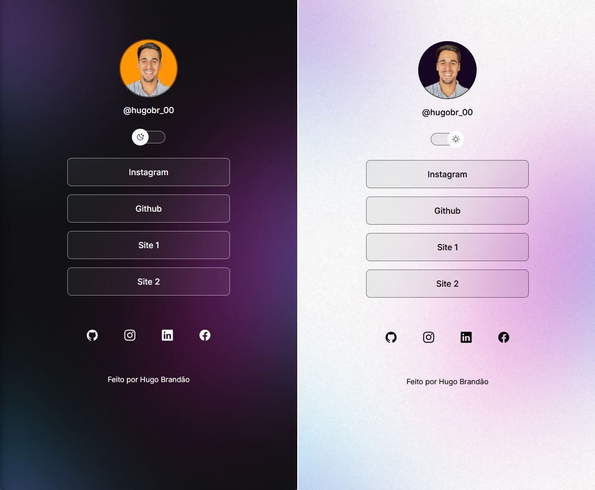

<h1 align="center"> Landing Page </h1>

Programa com a finalidade de fornecer uma landing page ao utilizador 

  

  <video alt="Video landingpage" src=".github/Vídeo sem título - Feito com Clipchamp (7).mp4" width="100%">

## 🚀 Tecnologias

Esse projeto foi desenvolvido com as seguintes tecnologias:

- HTML e CSS
- JavaScript
- Git e Github
- Figma
